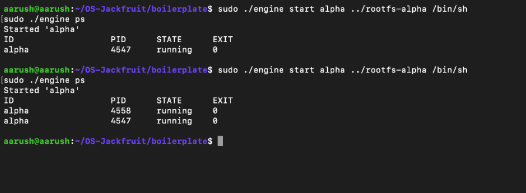
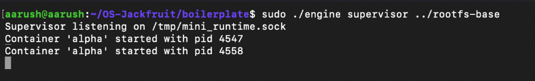
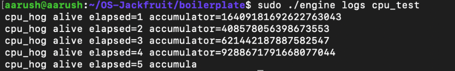
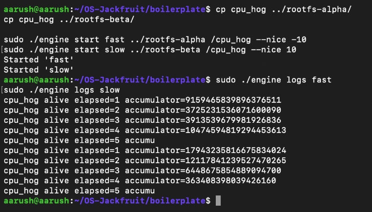
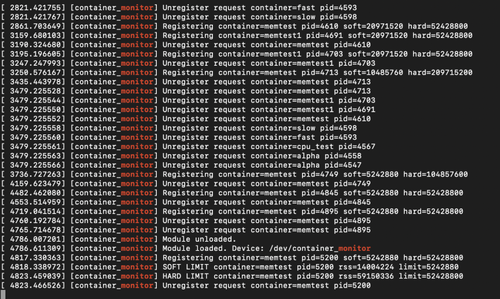
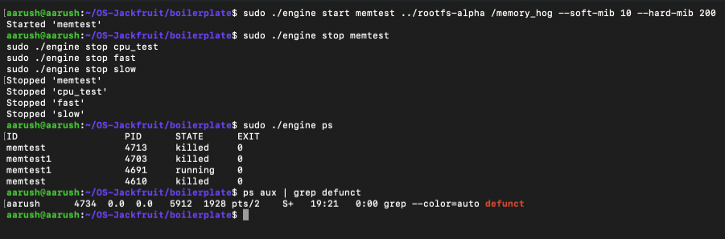
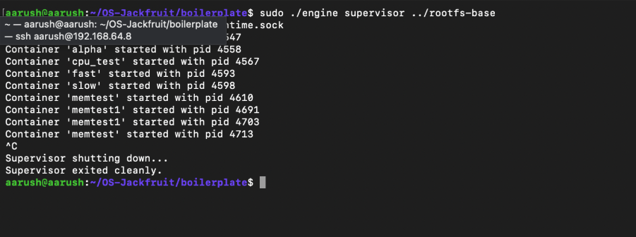

# Mini Container Runtime (OS-Jackfruit)

A lightweight container runtime implemented in C using Linux namespaces, process isolation, and a custom kernel module for memory monitoring.

---

## 📌 Overview

This project demonstrates how container systems like Docker work at a fundamental level. It provides:

* Process isolation using Linux namespaces
* Container lifecycle management via a supervisor
* Command-line interface for interaction
* Logging using a producer-consumer model
* CPU scheduling using nice values
* Memory monitoring and enforcement via a kernel module

---

## 🧩 Architecture

The system consists of three main components:

### 1. Engine (CLI)

User-facing interface for interacting with the system.

Commands:

* start – start a container
* stop – stop a container
* ps – list containers
* logs – view container logs

---

### 2. Supervisor

A long-running process that:

* Manages container lifecycle
* Tracks container metadata (ID, PID, state)
* Communicates via UNIX domain socket
* Handles logging and process cleanup

---

### 3. Monitor (Kernel Module)

A kernel-level module that:

* Tracks container memory usage (RSS)
* Enforces memory limits
* Issues soft warnings and hard termination

---

## ⚙️ Technologies Used

* C Programming
* Linux System Calls (clone, waitpid)
* Linux Namespaces (PID, UTS, Mount)
* UNIX Domain Sockets
* Kernel Modules
* IOCTL for user-kernel communication

---

## 🚀 Setup Instructions

### 1. Install dependencies

sudo apt update
sudo apt install build-essential linux-headers-$(uname -r) git

---

### 2. Build the project

cd boilerplate
make

---

### 3. Load kernel module

sudo insmod monitor.ko

---

### 4. Start supervisor

sudo ./engine supervisor ../rootfs-base

---

## ▶️ Usage

### Start a container

sudo ./engine start alpha ../rootfs-alpha /bin/sh

---

### List containers

sudo ./engine ps

---

### Run workload

cp cpu_hog ../rootfs-alpha/
sudo ./engine start cpu_test ../rootfs-alpha /cpu_hog

---

### View logs

sudo ./engine logs cpu_test

---

### Scheduling demo

sudo ./engine start fast ../rootfs-alpha /cpu_hog --nice -10
sudo ./engine start slow ../rootfs-alpha /cpu_hog --nice 10

---

### Memory monitoring

cp memory_hog ../rootfs-alpha/
sudo ./engine start memtest ../rootfs-alpha /memory_hog --soft-mib 5 --hard-mib 50

Check kernel logs:

sudo dmesg -w

---

## 🧪 Features Demonstrated

* Container isolation using namespaces
* Process management and lifecycle tracking
* Inter-process communication via UNIX sockets
* Logging with bounded buffer
* CPU scheduling behavior (nice values)
* Memory monitoring and enforcement using kernel module
* Clean teardown (no zombie processes)

---

## 📸 Output
### Task 1

Two containers running under one supervisor.

### Task 2

Output of engine ps showing container metadata.

### Task 3

Log file contents captured via logging pipeline.

### Task 4

CLI command issued and supervisor response.

### Task 5

dmesg output showing soft-limit warning.

### Task 6

dmesg output showing container killed, plus ps state.

### Task 7

Supervisor exit, containers stopped, module unloaded.

---

## 🧠 Concepts Covered

* Operating System Design
* Process Isolation
* Kernel Programming
* Memory Management
* Scheduling
* Synchronization

---

## 📌 Conclusion

This project provides a simplified implementation of container runtimes, showcasing key OS concepts such as namespaces, process management, and kernel-level resource control.

---

## 👨‍💻 Author

Aarush G

Gautam P.N.
